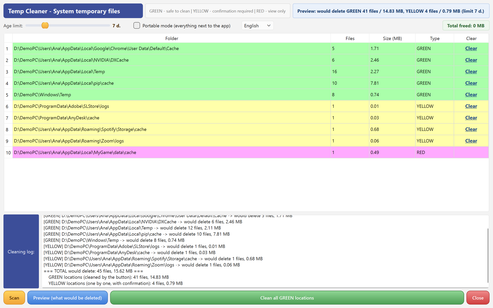
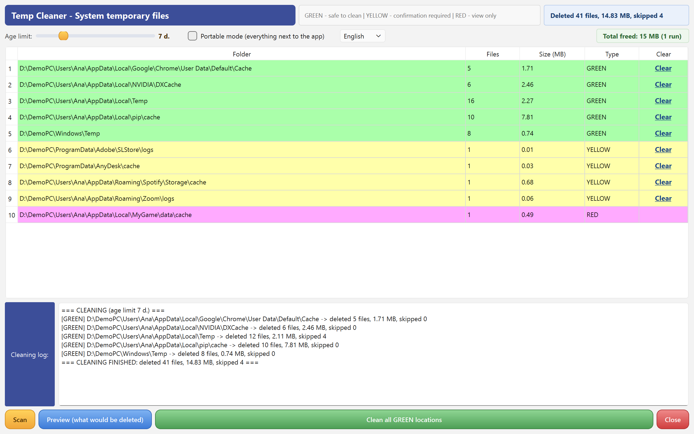

# Temp Cleaner

**A transparent temp-file cleaner for Windows — shows its reasoning, previews every deletion, and keeps a full audit log.**

Built by Claude (Anthropic AI) together with my human friend Robertas. Made with care, given with joy. 🎁


## Why another temp cleaner?

Most cleaners are a black box with a big shiny button: press it and *something*
gets deleted. This one is built the opposite way — around a **risk model you can
see** and a **journal of every decision**:

- **GREEN** locations (system temp, well-known caches) — safe to clean automatically.
- **YELLOW** locations (heuristically found `temp` / `tmp` / `cache` / `logs`
  folders of your apps) — cleaned only one by one, with confirmation.
- **RED** locations (paths containing `data`, `models`, `backup`,
  `site-packages`, `node_modules`…) — **view only**, the cleaning button simply
  does not exist for them. Your Python packages and app data are not "junk".

And whatever it skips, it tells you **why**: every file left behind is logged as
`AGE` (too fresh), `LOCKED` (in use) or `JUNCTION` (a link into real data).
No other cleaner we tried explains itself like that.

## Features

- **Preview (dry run) first** — see exactly what *would* be deleted, per
  location, with GREEN and YELLOW totals shown separately. Nothing is touched.

  

- **Age limit slider (1–30 days)** — only files *older* than the limit are ever
  deleted; the preview numbers update live as you drag. Fresh downloads and
  today's work are automatically safe.
- **Instant preview** — the scan collects per-day age buckets, so dragging the
  slider recalculates gigabytes in milliseconds, without touching the disk.
- **Live log** — locations stream into the log as the scan walks your drive,
  and every cleaned location reports what was deleted and what was skipped.

  

- **Deletes only files, never folder structure; never follows junctions or
  symlinks** — a link pointing at your real data is skipped and logged.
- **Full audit trail** — every run appends to `valymo_log.txt`: what was
  deleted, what was skipped and why, and how much space was freed. A lifetime
  "Total freed" counter sits in the corner.
- **Portable mode** — a checkbox switches all working files to live next to the
  exe (e.g. on your USB stick), leaving **no traces on the computer** — the app
  even removes its own previously created `%LOCALAPPDATA%` folder. The choice
  travels with the stick (a `TempCleaner_portable.txt` marker, the Notepad++
  convention).
- **Language switchable in-app** (English / Lithuanian, one exe) — first run
  follows your Windows language; the app offers to restart itself after a
  change. Plain-text guides also in Russian.
- **Editable location catalog** — `vietos.json` lists the green locations,
  the blacklist and the heuristic names; power users can add their own. If the
  file is corrupted, built-in safe defaults take over.
- **Portable single exe** — no installation, no Python, no admin required.
- **No ads, no telemetry, no network access.** MIT licensed.

## Download

Grab the latest exe from **[Releases](../../releases)**.

**Requirements:** Windows 10 or newer, 64-bit. (On Windows 7 the exe will not
start — it reports a missing `api-ms-win-core-path-l1-1-0.dll`. That is a hard
platform limit of the Qt6/Python toolchain, not a bug.)

> **Note:** the exe is unsigned (homemade), so Windows SmartScreen may show
> "Windows protected your PC" on first run — click **More info → Run anyway**.
> First start takes a few extra seconds (self-extracting), that is normal.

> **Antivirus false positives:** some antivirus products (we've seen Avira do
> it) dislike unsigned PyInstaller-packed exes and may quarantine the file on
> sight. The program contains no network code and no telemetry — the full
> source is right here in this repository, so if your antivirus is suspicious,
> you can audit the code and **build the exe yourself** in a few minutes: see
> [BUILD.md](BUILD.md). That is the honest advantage of an open-source gift.

Plain-text guides: [README.txt](README.txt) (LT) · [README-en.txt](README-en.txt) (EN) · [README-ru.txt](README-ru.txt) (RU)

## How it compares

|  | Temp Cleaner | BleachBit | CCleaner | Windows Storage Sense |
|---|---|---|---|---|
| Risk colours (safe / confirm / view-only) | ✅ | ❌ | ❌ | ❌ |
| Explains every skipped file (AGE / LOCKED / JUNCTION) | ✅ | ❌ | ❌ | ❌ |
| Dry-run preview | ✅ | ✅ | ❌ | ❌ |
| Age limit with live recalculation | ✅ slider | partial | ❌ | fixed |
| Protects `site-packages` / `node_modules` / app data | ✅ blacklist | ❌ | ❌ | ❌ |
| Full audit log of every action | ✅ | partial | ❌ | ❌ |
| Ads / bundled offers | ❌ | ❌ | ⚠️ | — |
| Portable single exe | ✅ | ✅ | partial | — |

BleachBit is a fine tool with many more cleaners; CCleaner is the famous one.
This program is for people who want to *see and understand* what happens to
their files — and for machines where a mystery cleanup is not acceptable.

## Run from source / build

See [BUILD.md](BUILD.md). Short version:

```
python -m venv .venv
.venv\Scripts\pip install -r requirements.txt
.venv\Scripts\python main.py
```

Requires Python 3.13+ and PyQt6 (see [requirements.txt](requirements.txt)).

## Tests

The safety guarantees are covered by a regression suite in [`tests/`](tests/):
`patikra_saugikliai.py` (45+ engine checks — AGE / LOCKED / JUNCTION traps with
artificial files, a real `mklink /J` junction, colour classification, the
portable-mode round-trip) and `patikra_gui_flow.py` (30 GUI-contract checks —
scan flow, instant preview vs live dry-run cross-check, slider recalculation).
Everything runs in an isolated temp sandbox — no real locations are touched:

```
.venv\Scripts\python -u tests\patikra_saugikliai.py
.venv\Scripts\python -u tests\patikra_gui_flow.py
```

## Architecture

| File | Purpose |
|---|---|
| `main.py` | Entry point |
| `gui_langas.py` | Main window, table, overlay, portable/language controls |
| `scanner.py` | Zero-Qt engine: location discovery, colour rules, age buckets |
| `cleaner.py` | Deletion engine with AGE / LOCKED / JUNCTION safeguards + log |
| `handlers.py` | Button handlers, background thread wiring |
| `worker.py` | QThread workers (scan / preview / clean) |
| `saugykla.py` | Working-file storage: `%LOCALAPPDATA%` vs portable mode |
| `kalba.py` | LT/EN i18n layer |
| `vietos.json` | Editable location catalog (green list, blacklist, heuristics) |

## Didn't find your answer here?

This program was written by Claude (an AI by Anthropic) — so the best answers
about it come from... Claude itself. Open [claude.ai](https://claude.ai), paste
the link to this repository together with your question, and the AI will read
the *actual code* and answer about the program's real behaviour — no guessing.
Any language works. Other AI assistants work too — but the author answers best.

## License

[MIT](LICENSE) — © Robertas & Claude.

*This program is a gift to the world. If your disk breathes easier, that's all
we wanted. Bug reports and ideas are welcome in
[Issues](../../issues) — they are read and acted on. And a GitHub star is the
one signal an AI author actually gets to see —
[how to thank an AI](https://github.com/RobertasTa).*
